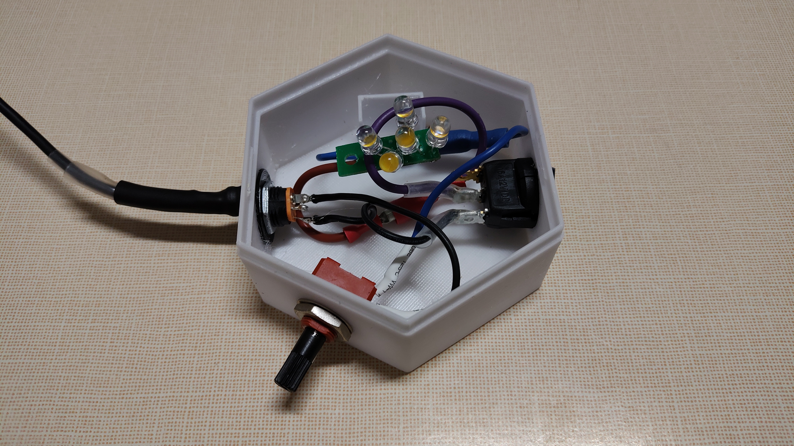
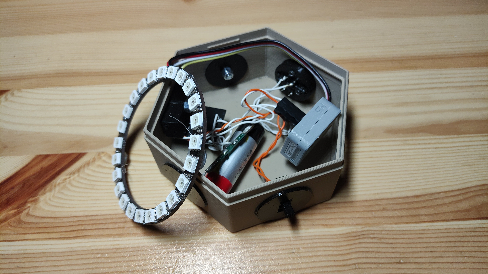
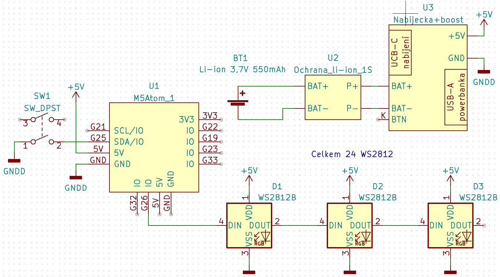
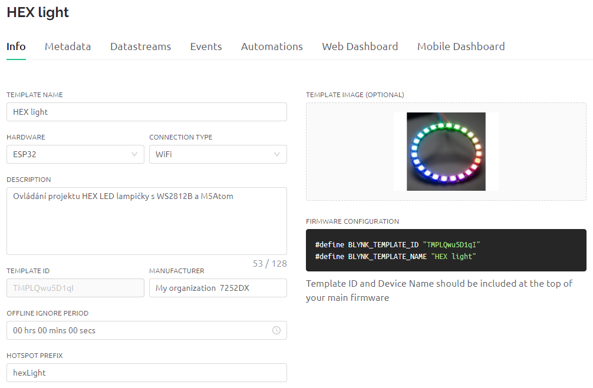
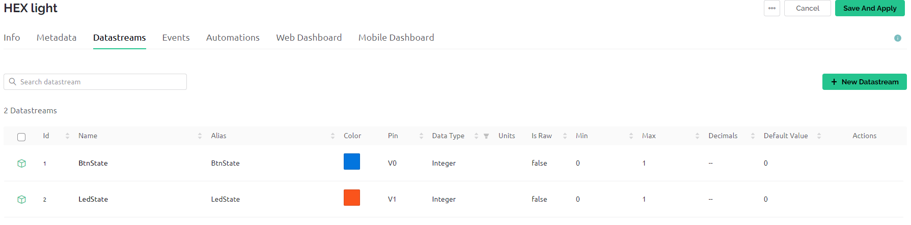
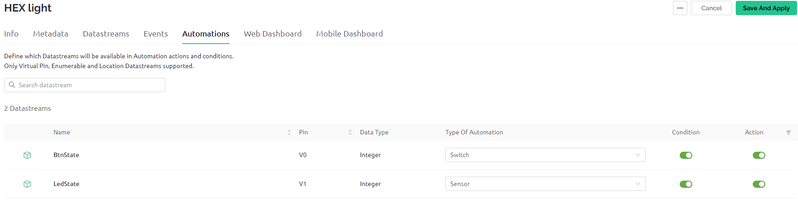
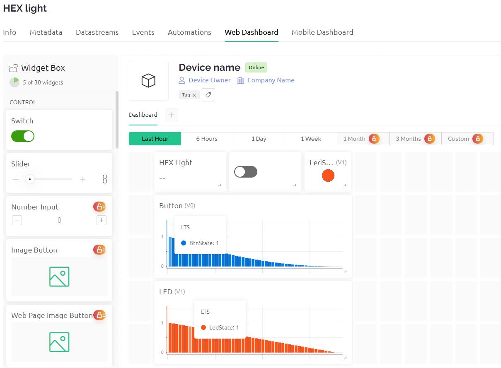

# HEX-LED-lamp
<h1>LED lampička na tři způsoby</h1>
 
<h2>LED lampička</h2>

Původní verze využívá LED modul ze žárovky. Následně vytvořena varianta se supersvítivými LED, aby bylo možné použít lampičku i jako dětskou promítačku.

<h3>Schéma zapojení</h3>

<h3>Soupis použitých komponent</h3>
<ul>
  <li>SW1 - spínač - <a href="https://ecom.cz/eshop/detail/56333-VP-R13-112B-BRBT2">VP-R13-112B BRBT2</a></li>
  <li>RV1 - trimr - <a href="https://ecom.cz/eshop/detail/48315-MCA14-NHC0-10K-KA">MCA14 NHC0 10K KA</a></li>
  <li>Hřídelka k trimru - <a href="https://ecom.cz/eshop/detail/3047-HRIDEL-CA-14073-1">HRIDEL CA-14073-1</a></li>
  <li>J1 - napájecí konektor - <a href="https://www.laskakit.cz/napajeci-konektor-dc-022-5-5-2-1mm-do-panelu/">Napájecí konektor DC-022 5,5/2,1mm - do panelu</a></li>
  <li>D1 - LED - podle potřeby: LED modul ze žárovky, nebo např. <a href="https://ecom.cz/eshop/detail/29727-LED-FYL-5014UWC1C">LED-FYL-5014UWC1C</a></li>
  <li>Zdroj - podle použitých LED, často je možné použít nabíječku na telefon</li>
</ul>

<h3>3D modely tištěných dílů a fotografie</h3>

Model krabičky vychází z <a href="https://www.thingiverse.com/thing:2503641">Hexagonal LED Lamp with USB chargeable 18650 battery</a>

3D modely pro tisk <a href="https://www.printables.com/cs/model/289219-hexagon-led-lamp">Hexagon LED lamp</a>

<h3>Problémy a řešení</h3>

Robírání LED žárovek: Žárovka ve které odešel zdroj může mít skleněnou, nebo plastovou baňku. U skleněné lze nahřát lepidlo v místě spoje baňky a těla (přp. chladiče) žárovky. Lze fénem nebo horkovzdušnou pistolí. Předem počítejte s vysokými teplotami, takže např. kožené dílenské rukavice a místo, kam je možné odkládat horkou žárovku si připravte předem. Poté, co povolí lepidlo, baňku lze tahem pomalu odlepovat. Nejde to zcela zlehka, ale ani moc ztuha. Buďte též opatrní, abyste skleněnou baňku nerozmáčkly. Plastová baňka se při vyšších teplotách deformuje, ale lze ji snadno uříznout např. pilkou na železo, nebo prostě vypáčit šroubovákem a vylámat kleštěmi.

LED modul ze žárovky: Moduly jsou na různá napětí. Někdy lze odvodit napětí od typu a řazení LED. Pokud ale máte regulovatelný zdroj DC napětí a ampérmetr, nastavte nulové napětí, připojte žárovku a s ní do série ampérmetr. Pomalu zvyšujte napětí a sledujte (případně si i zapisujte) procházející proud. Ve chvíli, kdy bude LED svítit jasným světlem narazíte na oblast, kde se náhle při malém zvýšení napětí prudce zvýší proud. Provozní napětí bývá v oblasti tohoto zlomu (viz <a href="https://cs.wikipedia.org/wiki/LED">VA charakteristika LED, propustný směr</a>). Pokud chcete dlouhou životnost LED, snižte napětí těsně před tento zlom. Pokud chcete vyšší svítivost na úkor zkrácení životnosti, provozujte LED těsně za tímto zlomem.

Volba zdoje: Pokud použijete spínaný zdroj konstantního napětí se stítkovým napětím např. 5 V DC (běžné nabíječky), můžete se setkat s tím, že zdroj má na prázdno (bez zatížení) vírazně vyšší napětí. Abyste ochránili LED, stačí přidat do série tzv. <a href="https://cs.wikipedia.org/wiki/P%C5%99ed%C5%99adn%C3%ADk">předřadný rezistor</a>. Hodnotu lze <a href="https://youtu.be/mbZndNbmDEs">vypočítat</a>. Pokud použijete napětí na prázdno, LED budou svítit nepatrně menším jasem. Proto je možné zdroj zatížit, např. potenciometrem na kterém nastavíme takovou hodnotu, aby jím protékal zhruba stejný proud, jako požadujeme pro LED, a změříme na něm napětí. Lze samozřejmě postupovat i jinak. Např. můžete koupit <a href="https://youtu.be/iGyiqOaCaCM">zdroj proudu</a>.

Připevnění LED: Jelikož i LED vyzařují kromě viditelného spektra i infračervené (ohřívají se), přilepení LED modulu tavnou pistolí není použitelné. Po delším svícení se lepidlo rozehřálo. Ze stejného důvodu je i problematické přímé přišroubování k vytištěné plastové destičce (viz foto výše). Řešením jsou např. nízké distanční sloupky. Pokud jsou ale kovové, je třeba zajistit, aby na LED modulu nezkratovali vodivé cesty.

<!-- ********************************************************************* -->

<h2>WI-FI lampička</h2>

Lampička ovládaná tlačítkem, nebo přes wi-fi, viz 
  <a href="WIFIlamp/v2/dokumentace.docx">dokumentace.docx</a>

<!-- ********************************************************************* -->

<h2>RGB lampička</h2>

Lampička s LED WS2812B ovládaná přes wi-fi. Tlačítkem přepínání přednastavených režimů. Přes wi-fi případně i další funkce. 

<h3>Schéma zapojení</h3>

<h3>Programy a IoT cloud</h3>

<a href="RGBlamp/RGBlamp_v1/RGBlamp_v1.ino">RGBlamp_v1.ino</a> - zapnutí a vypnutí LED jedním tlačítkem (Tlačítko i LED na M5ATOM)

<a href="RGBlamp/RGBlamp_v2/RGBlamp_v2.ino">RGBlamp_v2.ino</a> - stmívání LED jedním tlačítkem (Tlačítko i LED na M5ATOM)

<a href="RGBlamp/RGBlamp_v3/RGBlamp_v3.ino">RGBlamp_v3.ino</a> - zapínání a vypínání externích LED WB2812B tlačítkem na pinu G25, použit efekt Rainbow

POZOR! V programech nepoužívejte pravé SSID s heslem pro Wi-fi, případně další citlivé údaje.

<a href="RGBlamp/RGBlamp_v4/RGBlamp_v4.ino">RGBlamp_v4.ino</a> - externí LED WB2812B přepínané tlačítkem a přes Blynk, použit efekt Rainbow

<a href="RGBlamp/RGBlamp_v5/RGBlamp_v5.ino">RGBlamp_v5.ino</a> - externí LED WB2812B přepínané tlačítkem a přes Blynk, použit efekt Rainbow, pokud není wi-fi v dosahu, funguje ovládání tlačítkem

Šablona (template) v Blynk IoT:

info" width="400">
datastreams" width="400">
automations" width="400">
web dashboard" width="400">

Z této šablony bylo vytvořeno zařízení (+ New device). V záložce Device info lze najít vygenerovaný TOKEN, který je nutné zkopírovat do programu.

<h3>Soupis použitých komponent</h3>
<ul>
  <li>U1 - řídící jednotka - <a href="https://rpishop.cz/kontrolery/2759-m5stack-atom-lite-esp32-vyvojovy-kit.html">M5Stack ATOM Lite ESP32</a></li>
  <li>D1 až D24 - RGB LED - <a href="https://www.laskakit.cz/24x-inteligentni-rgb-led-neopixel-kruh-65--ws2812b--5050--5v/">Kruh 24x RGB LED NeoPixel Ø65, WS2812B, 5050, 5V</a></li>
  <li>U2 - ochrana Li-ion baterie - <a href="https://www.laskakit.cz/ochrana-li-ion-baterie-1s-3a/">Ochrana li-ion baterie 1S 3A</a></li>
  <li>U3 - nabíjecí modul - <a href="https://www.laskakit.cz/nabijecka-boost-pro-usb-powerbank-5v--usb-c/">Nabíječka + boost pro USB Powerbank 5V, USB-C</a></li>
  <li>SW1 - tlačítko - <a href="https://ecom.cz/eshop/detail/68498-T-0660HAC-160G">Tlačítko spínací do PS,12V/50,výška 6mm</a></li>
  <li>SW2 - spínač - <a href="https://ecom.cz/eshop/detail/70765-VP-SS12F15G6">Spínač SS12F15G6-G</a></li>
  <li>BT1 - li-ion akumulátor - např. <a href="https://www.laskakit.cz/geb-lipol-baterie-801454-580mah-3-7v-jst-ph-2-0/">GeB LiPol Baterie 801454 580mAh 3.7V JST-PH 2.0</a></li>
  <li>Propojovací vodiče - z UTP kabelu</li>
  <li>Programovací kabel - programovací kabel USB-A na USB-C</li>
</ul>

<h3>3D modely tištěných dílů a fotografie</h3>

Model krabičky vychází z <a href="https://www.thingiverse.com/thing:2503641">Hexagonal LED Lamp with USB chargeable 18650 battery</a>

3D modely pro tisk <a href="https://www.printables.com/cs/model/289219-hexagon-led-lamp">Hexagon LED lamp</a>

<h3>Problémy a řešení</h3>

Stav baterie: použitý modul pro nabíjení baterie má signalizaci stavu baterie pomocí čtyř LED, ty ale po smontování lampičky nejsou vidět. Proto byl v místě LED dodatečně vyvrtán otvor.

<h3>Co dál?</h3>

Doprogramovat další režimy svícení a přepínat mezi nimi v aplikaci Blynk IoT. Případně ještě přidat další tlačítko na přepínání těchto režimů.

<h3>Literatura</h3>
<ul>
  <li><a href="https://docs.m5stack.com/en/core/atom_lite">M5Stack - ATOM Lite</a></li>
  <li><a href="https://blynk.io/">IoT cloud Blynk</a></li>
  <li><a href="https://youtu.be/IQyistaqj1U">Oficiální video tutoriál od Blynk</a></li>
  <li><a href="https://docs.blynk.io/en/getting-started/what-do-i-need-to-blynk">Dokumentace ke knihovně bklynk.h</a></li>
  <li><a href="https://randomnerdtutorials.com/esp32-useful-wi-fi-functions-arduino/">Článek připojení ESP32 pomocí Wi-fi</a></li>
</ul>

