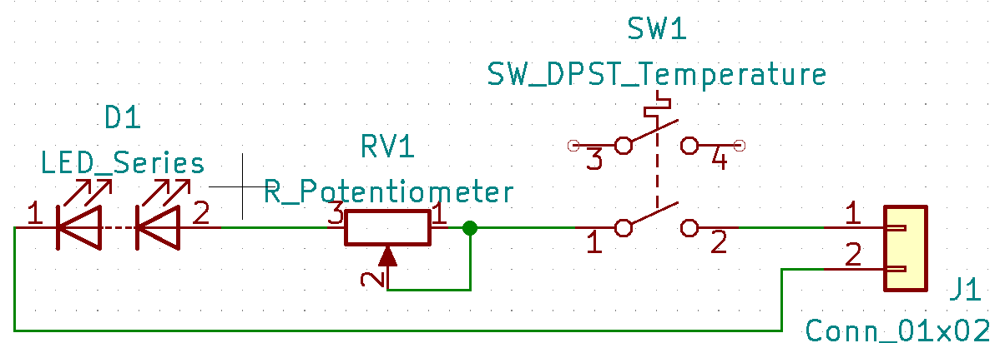

# HEX-LED-lamp
<h1>LED lampička na tři způsoby</h1>

<h2>LED lampička</h2>

Původní verze využívá LED modul ze žárovky. Následně vytvořena varianta se supersvítivými LED, aby bylo možné použít lampičku i jako dětskou promítačku.

<h3>Schéma zapojení</h3>

<h3>Soupis použitých komponent</h3>
<ul>
  <li>Spínač - <a href="https://ecom.cz/eshop/detail/56333-VP-R13-112B-BRBT2">VP-R13-112B BRBT2</a></li>
  <li>Trimr - <a href="https://ecom.cz/eshop/detail/48315-MCA14-NHC0-10K-KA">MCA14 NHC0 10K KA</a></li>
  <li>Hřídelka k trimru - <a href="https://ecom.cz/eshop/detail/3047-HRIDEL-CA-14073-1">HRIDEL CA-14073-1</a></li>
  <li>Napájecí konektor - <a href="https://www.laskakit.cz/napajeci-konektor-dc-022-5-5-2-1mm-do-panelu/">Napájecí konektor DC-022 5,5/2,1mm - do panelu</a></li>
  <li>LED - podle potřeby: LED modul ze žárovky, nebo např. <a href="https://ecom.cz/eshop/detail/29727-LED-FYL-5014UWC1C">LED-FYL-5014UWC1C</a></li>
  <li>Zdroj - podle použitých LED, často je možné použít nabíječku na telefon</li>
</ul>

<h3>3D modely tištěných dílů</h3>

Model krabičky vychází z <a href="https://www.thingiverse.com/thing:2503641">Hexagonal LED Lamp with USB chargeable 18650 battery</a>

3D modely pro tisk <a href="https://www.printables.com/cs/model/289219-hexagon-led-lamp">Hexagon LED lamp</a>

<h3>Fotodokumentace</h3>

<h3>Problémy a řešení</h3>

<h2>WI-FI lampička</h2>

Lampička ovládaná přes wi-fi. Přes tlačítko režimy zapnout, vypnout. A přes wi-fi i stmívání.

<h2>RGB lampička</h2>

Lampička s LED WS2812B ovládaná přes wi-fi. Tlačítkem přepínání přednastavených režimů. Přes wi-fi případně i další funkce. 

